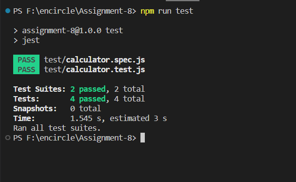
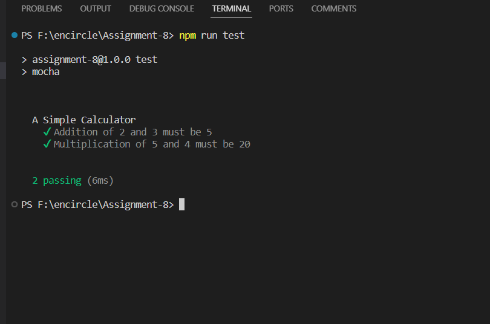
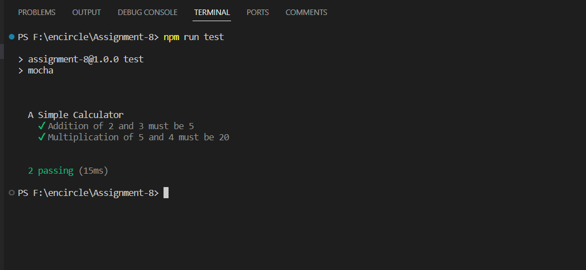
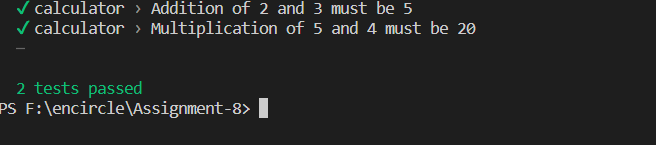

# Testing in Node JS

 - Testing is a method to analyze the behavior of code. It helps to maintain the quality of code and reduces the unknown bugs in the application. It allows us to check whether the application is performing as expected. It also helps businesses to understand the risk factor for building an application. There are frameworks available for testing in nodejs: `mocha`, `ava`, `tape`, `jasmine`, and `jest`.
  
 ## What is Node.js Testing?
 - Nodejs is an open-source project and runtime environment for javascript. Structuring and executing the tests for node applications can be called nodejs testing. In this article, We will learn to test the small pieces of code, called unit testing. Unit testing helps to detect the issues early and prevent errors in our node app. Unit tests are easy to write and set up than other testing methods. The expected value must be equal to the actual result else the unit test fails.

## Why is Testing Required?
 - Unit testing helps to detect the problems in our source code. We can run unit tests every time our source code changes. And identify whether our changed source code is working good as the previous source code. Without unit testing, We have to check a complete node app whether is working or not. Hence, unit testing reduces bugs and saves time which is good for customers as well as developers.
 

to see how testing works creating file named `calculator.js`:

calculator.js:

```
// Add two numbers
const add = (a, b) => {
    return parseInt(a) + parseInt(b);
}

// Multiply two numbers
const multiply = (a, b) => {
    return parseInt(a) * parseInt(b);
}

```

### Manual Testing:
```
const addResults = add(2, 3);
const multiplyResults = multiply(2, 3);

console.log("Addition of 2 and 3 is ", addResults)
console.log("Multiplication of 2 and 3 is ", multiplyResults)
```
we can do manual testing analysing the output . but it is not a good idea to manual testing with
when we have thousands of lines of code.

### Test Framework Installation
 - We will use the test framework jest to write the first unit test for our source code.
 - jest can be Installed with the following npm command.

```
npm install jest --save-dev
```

 - We will locate the scripts object in the file package.json and replace the test property as shown below.
```
"test": "jest"
```

create **`calculator.test.js`** in `test` folder:

```
const { add, multiply } = require("../calculator");


describe("A Simple Calculator", () => {
    
    
    test("Addition of 2 and 3 must be 5", () => {
        expect(add("2", "3")).toBe(5);
    });
    
    
    test("Multiplication of 5 and 4 must be 20",()=>{
        expect(multiply("5","4")).toBe(20);
    });
});
```
now run:
```
npm run test
```
### output



## Node.js Testing Frameworks
### Mocha
 - It is a javascript test framework that helps to run test cases for testing in nodejs and browsers.
 - mocha can be installed for the current project and globally with the following npm command `
 ```
npm install mocha --save-dev
```

 - set test scripts by replacing the test property in the folder package.json 
 ```
"test": "mocha"
```

`calculator.test.js`

```
const assert = require("assert");
const { add, multiply } = require("../calculator");

// Represent a group of related test
describe("A Simple Calculator", () => {
    it("Addition of 2 and 3 must be 5", () => {
        assert(add("2", "3"), 5);
    });
    it("Multiplication of 5 and 4 must be 20", () => {
        assert(multiply("5", "4"), 20);
    });
});

```
#### outptut:
 
 
 ## chai
 
  - It is an assertion library for nodejs and browsers. Generally, Assertion helps to compare the expected output with the actual output and return a boolean: true or false. We can use it with any javascript test framework. chai is mostly used with the javascript test framework mocha.
 - The assertion library chai help us to write tests in plain English
 - chai can be installed with the following npm command
 
```
npm install chai --save-dev
```

Now, We will replace the code of calculator.test.js with the following code.

```
const expect = require("chai").expect;
const { add, multiply } = require("../calculator");

// Represent a group of related test
describe("A Simple Calculator", () => {
    it("Addition of 2 and 3 must be 5", () => {
        expect(add("2", "3")).to.equal(5);
    });
    it("Multiplication of 5 and 4 must be 20", () => {
        expect(multiply("5", "4")).to.equal(20);
    });
});
```

#### output



## Ava
 - It is a lightweight and minimal testing framework and runs test cases for nodejs.
 - ava can be installed with the following npm command
 ```
npm install ava --save-dev
```
 - set  test scripts by replacing the test property in the folder package.json as shown below.
 ```
"test": "ava"
```
Now, We will replace the code of calculator.test.js with the following code
```
const test = require("ava")
const { add, multiply } = require("../calculator");

test("Addition of 2 and 3 must be 5", (t) => {
    t.is(add("2", "3"), 5);
});
test("Multiplication of 5 and 4 must be 20", (t) => {
    t.is(multiply("5", "4"), 20);
});
```

#### output



## Jasmine
 - It is an open-source test framework. It can be run on any platform that is built for javascript.
 - jasmine can be installed with the following npm command.
 ```
npm install jasmine --save-dev
```
- run the npm command npx jasmine init and it will create a new file jasmine.json in the directory spec/support.
- replace the code of jasmine.json with the following code
```
{
  "spec_dir": "test",
  "spec_files": [
    "**/*[sS]pec.?(m)js"
  ],
  "env": {
    "stopSpecOnExpectationFailure": false,
    "random": true
  }
}
```

 - create a new file named calculator.spec.js in the folder test/ and add the following code to `calaculator.spec.js`.
 ```
const { add, multiply } = require("../calculator");

// Represent a group of related test
describe("A Simple Calculator", () => {
    it("Addition of 2 and 3 must be 5", () => {
        expect(add("2", "3")).toEqual(5);
    });
    it("Multiplication of 5 and 4 must be 20", () => {
        expect(multiply("5", "4")).toEqual(20);
    });
});
```
 - set test scripts by replacing the test property in the folder package.json as shown below.
 ```
"test": "jasmine"
```

#### output


