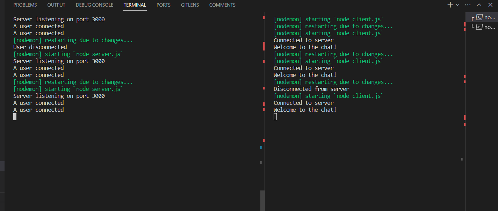

## Websockets

  -  ######  Web Socket is a protocol that provides full-duplex(multiway) communication i.e allows communication in both directions simultaneously.
  -  ###### It is a modern web technology in which there is a continuous connection between the user’s browser(client) and the server. In this type of communication, between the web server I the web browser, both of them can send messages to each other at any point in time. 
  -  ###### Traditionally on the web, we had a request/response format where a user sends an HTTP request and the server responds to that. This is still applicable in most cases, especially those using RESTful API. But a need was felt for the server to also communicate with the client, without getting polled(or requested) by the client. The server in itself should be able to send information to the client or the browser. This is where Web Socket comes into the picture
 
### Installation
```
npm i --save socket.io socket.io-client express readline
```
### code 

### server.js:

```
const http = require('http');
const socketIo = require('socket.io');

const server = http.createServer();
const io = socketIo(server);

const PORT = 3000;

io.on('connection', (socket) => {
  console.log('A user connected');

  socket.on('chat message', (msg) => {
    console.log(`Client says: ${msg}`);
    
    io.emit('chat message', `Server: ${msg}`);
  });

  socket.emit('chat message', 'Welcome to the chat!');

  socket.on('disconnect', () => {
    console.log('User disconnected');
  });
});

server.listen(PORT, () => {
  console.log(`Server listening on port ${PORT}`);
});

```
## client.js

```
const io = require('socket.io-client');

const socket = io('http://localhost:3000', {
  transports: ['websocket'],
});

socket.on('connect', () => {
  console.log('Connected to server');

  socket.on('chat message', (msg) => {
    console.log(msg);
  });

  process.stdin.on('data', (data) => {
    const message = data.toString().trim();
    socket.emit('chat message', `Client: ${message}`);
  });

  socket.on('disconnect', () => {
    console.log('Disconnected from server');
    process.exit(0);
  });
});

```
output:



### Real-Time Applications
 - As the name suggests, a real-time application is an application working with real-time data. Data can change with time and sometimes the data changes extremely quickly. It is called Real-Time data when the data changes very frequently. Real-time data include stock data, live match data, etc. Here are a few examples of modern Real-time applications

 - ` Crypto-currency Exchange Application`: Application for tracking real-time prices of crypto-currencies. Eg. Binance
 - `Chat Application or Instant Messaging`: Application for real-time communication between two or multiple people. Eg. Whatsapp, Facebook Messenger
 - `Online Games`: Multiplayer games that involve real-time party play are also using real-time communication. Eg. Valorant, Fortnite, etc.
 - `Social Media`: Instant notifications and updates use WebSockets.
 - `Enterprise Work Applications`: Applications that enable collaborative work where multiple users can work on the same project simultaneously. Eg. Google Docs, Sheets, Figma, etc.
 - 
 
